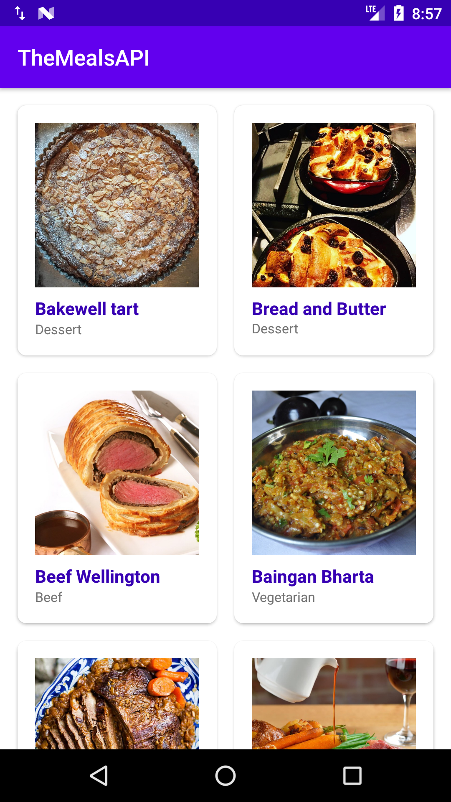
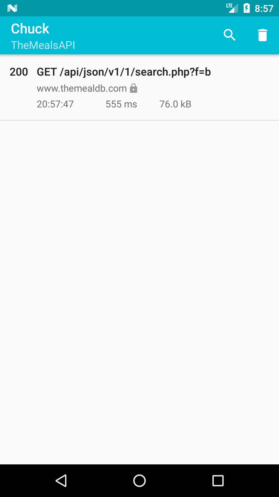
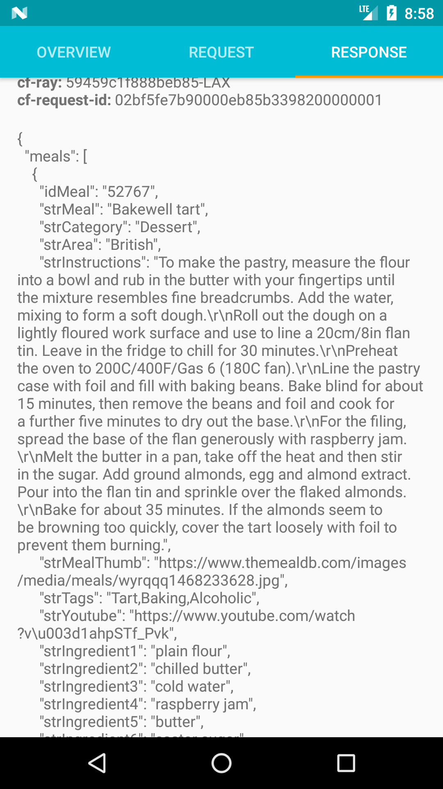
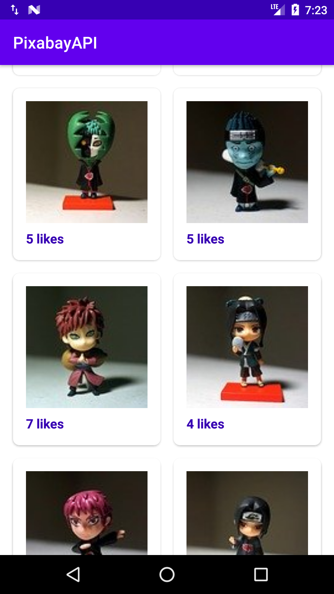
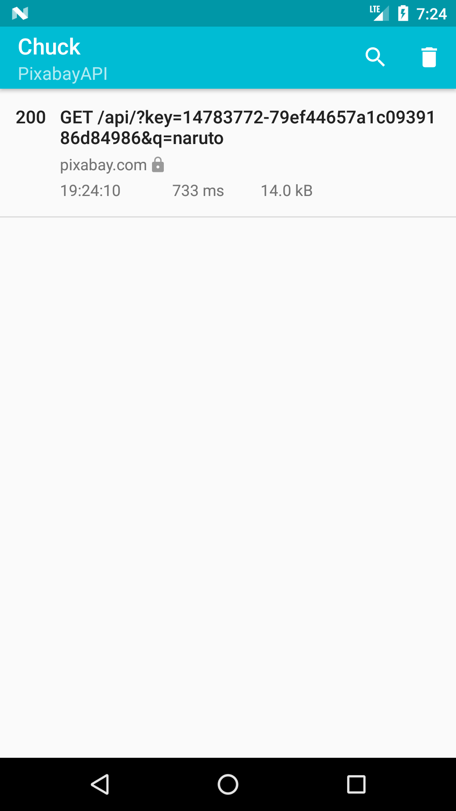
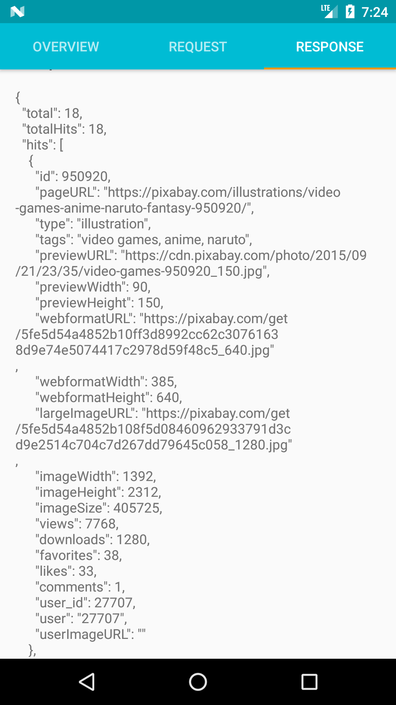
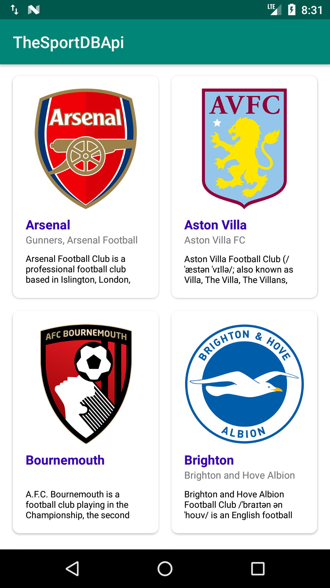
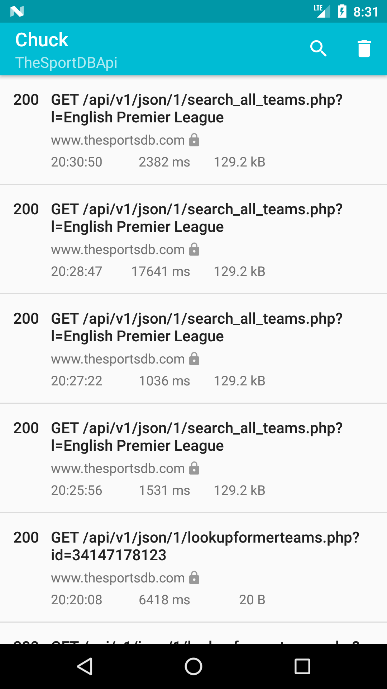
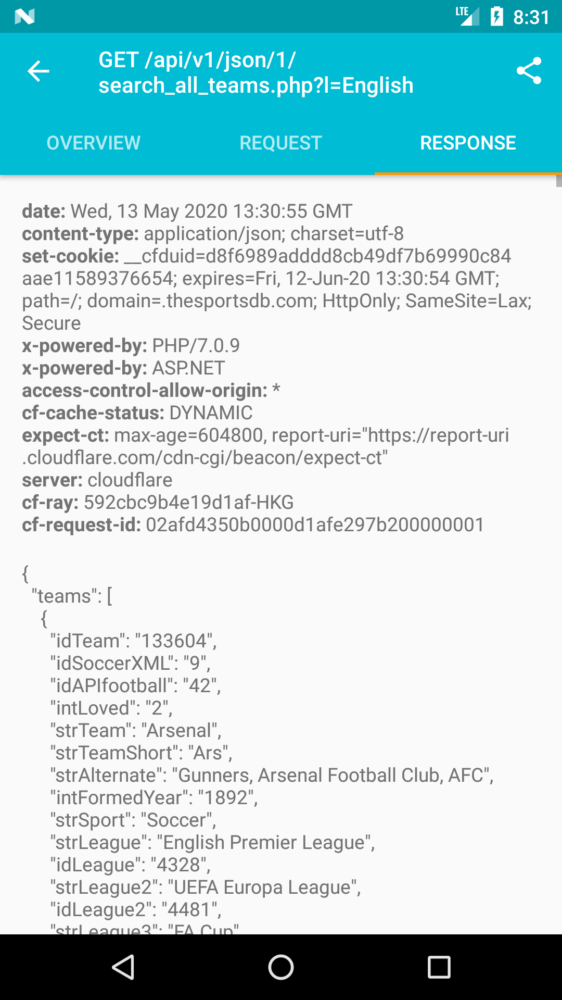

## About This Project

  
SDK for anything your problem to make easier developing android apps

## Screen Shoot
| The Meals API      |   Chuck Data 1               |   Chuck Data 2        |
|:------------------:|:----------------------------:|:---------------------:|
|  |  |  |

|TV                  |   Movie                      |     Person            |
|:------------------:|:----------------------------:|:---------------------:|
|  |  |  |

| The Meals API      |   Chuck Data 1               |   Chuck Data 2        |
|:------------------:|:----------------------------:|:---------------------:|
|  |  |  |

## Version Release
This Is Latest Release

    $version_release = 1.0.2

What's New??

    * update: upgrade from FrogoResponseCallback to ConsumeApiResponse *

## Download this project

### Step 1. Add the JitPack repository to your build file (build.gradle : Project)
    
    Add it in your root build.gradle at the end of repositories:
    
    	allprojects {
    		repositories {
    			...
    			maven { url 'https://jitpack.io' }
    		}
    	}
      
### Step 2. Add the dependency (build.gradle : Module)
    
    dependencies {
            // library frogo-consume-api
            implementation 'com.github.frogobox:frogo-consume-api:1.0.2'
    }

### Step 3. Click Detail Below

News Api

### About
Eliminates the method of retrieving json data using retrofit repeatedly. so this project has a set of functions to retrieve data without the need for fetching data using the retrofit of the API

### Documentation The News API
https://newsapi.org/

### Screenshoot Apps
| News API           |   Chuck Data 1               |   Chuck Data 2        |
|:------------------:|:----------------------------:|:---------------------:|
| |  |  |

### Declaration ConsumeNewsApi

	val consumeNewsApi = ConsumeNewsApi(NewsUrl.NEWS_API_KEY) // Your API_KEY
    consumeNewsApi.usingChuckInterceptor(this) // Using Chuck Interceptor
    consumeNewsApi.getTopHeadline( // Adding Base Parameter on main function
        null, 
        null,
        CATEGORY_HEALTH,
        COUNTRY_ID,
        null,
        null,
        object : ConsumeApiResponse<ArticleResponse> {
            override fun onSuccess(data: ArticleResponse) {
                // Your Ui or data
            }

            override fun onFailed(statusCode: Int, errorMessage: String?) {
                // Your failed to do
            }

            override fun onShowProgress() {
                // Your Progress Show
            }

            override fun onHideProgress() {
                // Your Progress Hide
            }

        })
	

### Contant Value Category

    object NewsConstant {
    
        const val CATEGORY_BUSINESS = "business"
        const val CATEGORY_ENTERTAIMENT = "entertainment"
        const val CATEGORY_GENERAL = "general"
        const val CATEGORY_HEALTH = "health"
        const val CATEGORY_SCIENCE = "science"
        const val CATEGORY_SPORTS = "sports"
        const val CATEGORY_TECHNOLOGY = "technology"
    
    }

### Function Main From This Project
    // Switch For Using Chuck Interceptor
    fun usingChuckInterceptor(context: Context)

    // Get Top Headline
    fun getTopHeadline(
        q: String?,
        sources: String?,
        category: String?,
        country: String?,
        pageSize: Int?,
        page: Int?,
        callback: ConsumeApiResponse<ArticleResponse>
    )

    // Get Everythings
    fun getEverythings(
        q: String?,
        from: String?,
        to: String?,
        qInTitle: String?,
        sources: String?,
        domains: String?,
        excludeDomains: String?,
        language: String?,
        sortBy: String?,
        pageSize: Int?,
        page: Int?,
        callback: ConsumeApiResponse<ArticleResponse>
    )

    // Get Sources
    fun getSources(
        language: String,
        country: String,
        category: String,
        callback: ConsumeApiResponse<SourceResponse>
    )

Meal Api

### About    
Eliminates the method of retrieving json data using retrofit repeatedly. so this project has a set of functions to retrieve data without the need for fetching data using the retrofit of the API  

### Documentation The News API
https://www.themealdb.com/api.php

### Screen Shoot Apps
| The Meals API      |   Chuck Data 1               |   Chuck Data 2        |
|:------------------:|:----------------------------:|:---------------------:|
|  |  |  |
    

### Declaration ConsumeTheMealDbApi</h3>

	val consumeMealApi = ConsumeTheMealDbApi("1") Your API_KEY
    consumeMealApi.usingChuckInterceptor(this) // Using Chuck Interceptor
    consumeMealApi.listAllCateories(object : ConsumeApiResponse<MealResponse<Category>> {
        override fun onSuccess(data: MealResponse<Category>) {

            // * PLACE YOUR CODE HERE FOR UI / ARRAYLIST *

        }

        override fun onFailed(statusCode: Int, errorMessage: String?) {
            // Failed Status
        }

        override fun onShowProgress() {
            // Show Your Progress View
        }

        override fun onHideProgress() {
            // Hide Your Progress View
        }
        
    })
	

### Function Main From This Project

    // Switch For Using Chuck Interceptor
    fun usingChuckInterceptor(context: Context)

    // Search meal by name
    fun searchMeal(mealName: String, callback: ConsumeApiResponse<MealResponse<Meal>>)

    // List all meals by first letter
    fun listAllMeal(firstLetter: String, callback: ConsumeApiResponse<MealResponse<Meal>>)

    // Lookup full meal details by id
    fun lookupFullMeal(idMeal: String, callback: ConsumeApiResponse<MealResponse<Meal>>)

    // Lookup a single random meal
    fun lookupRandomMeal(callback: ConsumeApiResponse<MealResponse<Meal>>)

    // List all meal categories
    fun listMealCategories(callback: ConsumeApiResponse<CategoryResponse>)

    // List all Categories
    fun listAllCateories(callback: ConsumeApiResponse<MealResponse<Category>>)

    // List all Area
    fun listAllArea(callback: ConsumeApiResponse<MealResponse<Area>>)

    // List all Ingredients
    fun listAllIngredients(callback: ConsumeApiResponse<MealResponse<Ingredient>>)

    // Filter by main ingredient
    fun filterByIngredient(ingredient: String, callback: ConsumeApiResponse<MealResponse<MealFilter>>)

    // Filter by Category
    fun filterByCategory(category: String, callback: ConsumeApiResponse<MealResponse<MealFilter>>)

    // Filter by Area
    fun filterByArea(area: String, callback: ConsumeApiResponse<MealResponse<MealFilter>>)
    

Pixabay Api

### About
Eliminates the method of retrieving json data using retrofit repeatedly. so this project has a set of functions to retrieve data without the need for fetching data using the retrofit of the API

### Documentation Pixabay Api
https://pixabay.com/api/docs/

### Screen Shoot Apps
| Pixabay API        |   Chuck Data 1               |   Chuck Data 2        |
|:------------------:|:----------------------------:|:---------------------:|
|  | |  |

### Declaration ConsumePixabayApi

    val consumePixabayApi = ConsumePixabayApi(PixabayConstant.API_KEY) // Your API Key
    consumePixabayApi.usingChuckInterceptor(this) // Using Chuck Interceptor

    val query = "Nature"

    consumePixabayApi.searchImage(
        query,
        null,
        null,
        null,
        null,
        null,
        null,
        null,
        null,
        null,
        null,
        null,
        null,
        null,
        object : ConsumeApiResponse<Response<PixabayImage>> {
            override fun onSuccess(data: Response<PixabayImage>) {
                // Place your UI / Data
            }

            override fun onFailed(statusCode: Int, errorMessage: String?) {
                // failed to do
            }

            override fun onShowProgress() {
                // showing your progress view
            }

            override fun onHideProgress() {
                // hide your progress view
            }
        })

### Function Main From This Project
    // Switch For Using Chuck Interceptor
    fun usingChuckInterceptor(context: Context)

    // Search for Image
    fun searchImage(
        q: String,
        lang: String?,
        id: String?,
        imageType: String?,
        orientation: String?,
        category: String?,
        minWidth: Int?,
        minHeight: Int?,
        colors: String?,
        editorsChoice: Boolean?,
        safeSearch: Boolean?,
        order: String?,
        page: Int?,
        perPage: Int?,
        callback: ConsumeApiResponse<Response<PixabayImage>>
    )

    // Search for Video
    fun searchVideo(
        q: String,
        lang: String?,
        id: String?,
        videoType: String?,
        category: String?,
        minWidth: Int?,
        minHeight: Int?,
        editorsChoice: Boolean?,
        safeSearch: Boolean?,
        order: String?,
        page: Int?,
        perPage: Int?,
        callback: ConsumeApiResponse<Response<PixabayVideo>>
    )
    

Sport Api

### About
Eliminates the method of retrieving json data using retrofit repeatedly. so this project has a set of functions to retrieve data without the need for fetching data using the retrofit of the API

### Documentation THE SPORT DB API
https://www.thesportsdb.com/api.php

### Screenshoot Apps

| The Sport DB API   |   Chuck Data 1               |   Chuck Data 2        |
|:------------------:|:----------------------------:|:---------------------:|
| |  |  |

    
### Declaration ConsumeTheSportDbApi

	val consumeTheSportDbApi = ConsumeTheSportDbApi("1") // "1" is API KEY
	
	consumeTheSportDbApi.usingChuckInterceptor(this) // This is Code Chuck Interceptor
	
    consumeTheSportDbApi.searchForPlayerByName(
        "Danny Welbeck",
        object : ConsumeApiResponse<Players> {
            override fun onSuccess(data: Players) {
                
                // * PLACE YOUR CODE HERE FOR UI / ARRAYLIST *

            }

            override fun onFailed(statusCode: Int, errorMessage: String?) {
                // failed result
            }

            override fun onShowProgress() {
                // showing your progress view
            }

            override fun onHideProgress() {
                // hiding your progress view
            }
        })

### Function Main From This Project

    // Switch For Using Chuck Interceptor
    fun usingChuckInterceptor(context: Context)

    // Search for team by name
    fun searchForTeamByName(teamName: String?, sportResultCallback: ConsumeApiResponse<Teams>)

    // Search for team short code
    fun searchForTeamByShortCode(shortCode: String?, sportResultCallback: ConsumeApiResponse<Teams>)

    // Search for all players from team *Patreon ONLY*
    fun searchForAllPlayer(teamName: String?, sportResultCallback: ConsumeApiResponse<Players>)

    // Search for players by player name
    fun searchForPlayer(playerName: String?, sportResultCallback: ConsumeApiResponse<Players>)

    // Search for players by player name and team name
    fun searchForPlayer(playerName: String?, teamName: String?, sportResultCallback: ConsumeApiResponse<Players>)

    // Search for event by event name
    fun searchForEvent(eventName: String?, sportResultCallback: ConsumeApiResponse<Events>)

    // Search For event by event name and season
    fun searchForEvent(eventName: String?, season: String?, sportResultCallback: ConsumeApiResponse<Events>)

    // Search for event by event file name
    fun searchForEventFileName(eventFileName: String?, sportResultCallback: ConsumeApiResponse<Events>)

    // List all sports
    fun getAllSports(sportResultCallback: ConsumeApiResponse<Sports>)

    // List all leagues
    fun getAllLeagues(sportResultCallback: ConsumeApiResponse<Leagues>)

    // List all Leagues in a country
    fun searchAllLeagues(countryName: String?, sportResultCallback: ConsumeApiResponse<Countrys>)

    // List all Leagues in a country specific by sport
    fun searchAllLeagues(countryName: String?, sportName: String?, sportResultCallback: ConsumeApiResponse<Countrys>)

    // List all Seasons in a League
    fun searchAllSeasons(idTeam: String?, sportResultCallback: ConsumeApiResponse<Seasons>)

    // List all Teams in a League
    fun searchAllTeam(league: String?, sportResultCallback: ConsumeApiResponse<Teams>)

    // List all Teams in Sportname & Country Name
    fun searchAllTeam(sportName: String?, countryName: String?, sportResultCallback: ConsumeApiResponse<Teams>)

    // List All teams details in a league by Id
    fun lookupAllTeam(idLeague: String?, sportResultCallback: ConsumeApiResponse<Teams>)

    // List All players in a team by Team Id *Patreon ONLY*
    fun lookupAllPlayer(idTeam: String?, sportResultCallback: ConsumeApiResponse<Players>)

    // List all users loved teams and players
    fun searchLoves(userName: String?, sportResultCallback: ConsumeApiResponse<Users>)

    // League Details by Id
    fun lookupLeagues(idLeague: String?, sportResultCallback: ConsumeApiResponse<Leagues>)

    // Team Details by Id
    fun lookupTeam(idTeam: String?, sportResultCallback: ConsumeApiResponse<Teams>)

    // Player Details by Id
    fun lookupPlayer(idPlayer: String?, sportResultCallback: ConsumeApiResponse<Players>)

    // Event Details by Id
    fun lookupEvent(idEvent: String?, sportResultCallback: ConsumeApiResponse<Events>)

    // Player Honours by Player Id
    fun lookupHonour(idPlayer: String?, sportResultCallback: ConsumeApiResponse<Honors>)

    // Player Former Teams by Player Id
    fun lookupFormerTeam(idPlayer: String?, sportResultCallback: ConsumeApiResponse<FormerTeams>)

    // Player Contracts by Player Id
    fun lookupContract(idPlayer: String?, sportResultCallback: ConsumeApiResponse<Contracts>)

    // Lookup Table by League ID and Season
    fun lookupTable(idLeague: String?, season: String?, sportResultCallback: ConsumeApiResponse<Tables>)

    // Next 5 Events by Team Id
    fun eventsNext(idTeam: String?, sportResultCallback: ConsumeApiResponse<Events>)

    // Next 15 Events by League Id
    fun eventsNextLeague(idLeague: String?, sportResultCallback: ConsumeApiResponse<Events>)

    // Last 5 Events by Team Id
    fun eventsLast(idTeam: String?, sportResultCallback: ConsumeApiResponse<Results>)

    // Last 15 Events by League Id
    fun eventsPastLeague(idLeague: String?, sportResultCallback: ConsumeApiResponse<Events>)

    // Events in a specific round by league id/round/season
    fun eventsRound(idLeague: String?, round: String?, season: String?, sportResultCallback: ConsumeApiResponse<Events>)

    // All events in specific league by season (Free tier limited to 200 events)
    fun eventsSeason(idLeague: String?, season: String?, sportResultCallback: ConsumeApiResponse<Events>)

    

Movie Api

    
### About
Eliminates the method of retrieving json data using retrofit repeatedly. so this project has a set of functions to retrieve data without the need for fetching data using the retrofit of the API

### Documentation The Movie DB API
https://developers.themoviedb.org/3/getting-started/introduction

### Screen Shoot Apps
|TV                  |   Movie                      |     Person            |       Chuck Data  |
|:------------------:|:----------------------------:|:---------------------:|:-----------------:|
|  |  |  |  |

### Step 3. Declaration ConsumeMovieApi

    val consumeMovieApi = ConsumeMovieApi(MovieUrl.API_KEY) // your api_key
    consumeMovieApi.usingChuckInterceptor(this) // This is Code Chuck Interceptor
    consumeMovieApi.getMovieChangeList(
        null,
        null,
        null,
        object : ConsumeApiResponse<Changes> {
            override fun onSuccess(data: Changes) {
                // * PLACE YOUR CODE HERE FOR UI / ARRAYLIST *
            }

            override fun onFailed(statusCode: Int, errorMessage: String?) {
                // failed result
            }

            override fun onShowProgress() {
                // showing your progress view
            }

            override fun onHideProgress() {
                // hiding your progress view
            }
        })
	

### Function Main From This Project
- Chuck Interceptor [Here](https://github.com/frogobox/frogo-consume-api/tree/master/docs/tutorial/movie/ChuckInterceptor.md)
- Certifications [Here](https://github.com/frogobox/frogo-consume-api/tree/master/docs/tutorial/movie/Certifications.md)
- Changes [Here](https://github.com/frogobox/frogo-consume-api/tree/master/docs/tutorial/movie/Changes.md)
- Collection [Here](https://github.com/frogobox/frogo-consume-api/tree/master/docs/tutorial/movie/Collection.md)
- Companies [Here](https://github.com/frogobox/frogo-consume-api/tree/master/docs/tutorial/movie/Companies.md)
- Configuration [Here](https://github.com/frogobox/frogo-consume-api/tree/master/docs/tutorial/movie/Configuration.md)
- Credits [Here](https://github.com/frogobox/frogo-consume-api/tree/master/docs/tutorial/movie/Credits.md)
- Discover [Here](https://github.com/frogobox/frogo-consume-api/tree/master/docs/tutorial/movie/Discover.md)
- Find [Here](https://github.com/frogobox/frogo-consume-api/tree/master/docs/tutorial/movie/Find.md)
- Genres [Here](https://github.com/frogobox/frogo-consume-api/tree/master/docs/tutorial/movie/Genres.md)
- Keyords [Here](https://github.com/frogobox/frogo-consume-api/tree/master/docs/tutorial/movie/Keywords.md)
- Reviews [Here](https://github.com/frogobox/frogo-consume-api/tree/master/docs/tutorial/movie/Reviews.md)
- Trending [Here](https://github.com/frogobox/frogo-consume-api/tree/master/docs/tutorial/movie/Trending.md)
- Networks [Here](https://github.com/frogobox/frogo-consume-api/tree/master/docs/tutorial/movie/Networks.md)
- Movies [Here](https://github.com/frogobox/frogo-consume-api/tree/master/docs/tutorial/movie/Movies.md)
- Search [Here](https://github.com/frogobox/frogo-consume-api/tree/master/docs/tutorial/movie/Search.md)
- TV [Here](https://github.com/frogobox/frogo-consume-api/tree/master/docs/tutorial/movie/TV.md)
- TV Seasons [Here](https://github.com/frogobox/frogo-consume-api/tree/master/docs/tutorial/movie/TVSeasons.md)
- TV Episodes [Here](https://github.com/frogobox/frogo-consume-api/tree/master/docs/tutorial/movie/TVEpisodes.md)
- TV Episodes Groups [Here](https://github.com/frogobox/frogo-consume-api/tree/master/docs/tutorial/movie/TVEpisodesGroups.md)
- People [Here](https://github.com/frogobox/frogo-consume-api/tree/master/docs/tutorial/movie/People.md)
- * ON DEVELOPMENT [Here](https://github.com/frogobox/frogo-consume-api/tree/master/docs/tutorial/movie/Development.md)

### Github Actions Hackathon (March 5-31, 2020) [See list winner](https://github.com/frogobox/frogo-consume-api/blob/master/docs/github_action_hackathon_winners.xlsx)
:star: This four-week hackathon challenges the community to create original GitHub Actions. Actions connect all of the tools in your workflow: You can solve problems, build containers, deploy to any cloud, and more.    

## Colaborator
Very open to anyone, I'll write your name under this, please contribute by sending an email to me

- Mail To faisalamircs@gmail.com
- Subject : Github _ [Github-Username-Account] _ [Language] _ [Repository-Name]
- Example : Github_amirisback_kotlin_admob-helper-implementation

Name Of Contribute
- Muhammad Faisal Amir
- Waiting List
- Waiting List

Waiting for your contribute

## Attention !!!
- Please enjoy and don't forget fork and give a star
- Don't Forget Follow My Github Account

